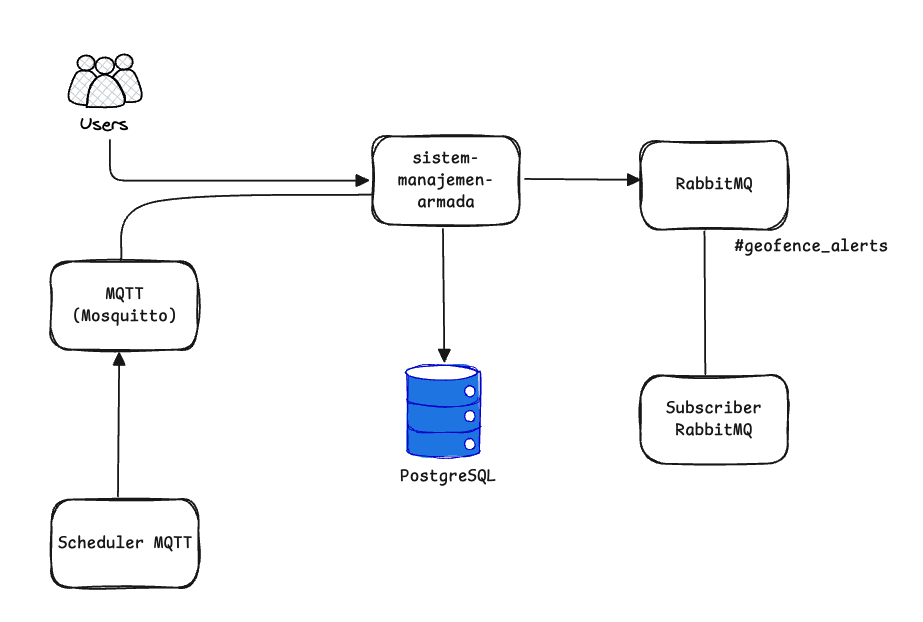

# Sistem Manajemen Armada

A Go-based fleet management system with real-time vehicle location tracking, geofence detection, and event notifications using MQTT and RabbitMQ.

## Architecture



### Components

The system consists of the following logical components:

**1. Scheduler MQTT** (`worker/worker.go`)
- Simulates GPS devices by publishing vehicle locations every 2 seconds
- Publishes to MQTT broker on topic `/fleet/vehicle/{id}/location`
- Generates random coordinates within ±50 meters of Jakarta

**2. sistem-manajemen-armada** (Main Application)
- **MQTT Handler**: Subscribes to vehicle location updates from MQTT broker
- **Business Logic**: Processes location data, stores in PostgreSQL, detects geofence events
- **RabbitMQ Publisher**: Publishes geofence alerts to `geofence_alerts` queue
- **HTTP API**: REST endpoints for querying vehicle location history

**3. Subscriber RabbitMQ** (`worker/worker.go`)
- Consumes geofence alerts from RabbitMQ queue
- Processes/logs alert events for monitoring

**External Dependencies:**
- **MQTT Broker** (Mosquitto): Handles vehicle location message routing
- **RabbitMQ**: Event broker for geofence alerts
- **PostgreSQL**: Persistent storage for vehicle location history


## Tech Stack

- **Language**: Go 1.24.2
- **Web Framework**: Fiber v2
- **Database**: PostgreSQL 16
- **Message Broker**: RabbitMQ 3.13
- **MQTT Broker**: Eclipse Mosquitto 2.0
- **ORM**: GORM
- **Logger**: Uber Zap
- **Validator**: go-playground/validator

## Prerequisites

- Docker & Docker Compose (for containerized deployment)
- OR:
  - Go 1.24.2+
  - PostgreSQL 16+
  - RabbitMQ 3.13+
  - Eclipse Mosquitto 2.0+

## Quick Start with Docker

### 1. Start all services

```bash
docker compose up
```

This will start:
- PostgreSQL (port 5432)
- RabbitMQ (port 5672, Management UI: 15672)
- Mosquitto MQTT (port 1883)
- App (port 3000)

### 2. Check service status

```bash
docker compose ps
```

### 3. View logs

```bash
# All services
docker compose logs -f

# Specific service
docker compose logs -f app
docker compose logs -f mosquitto
docker compose logs -f rabbitmq
```

### 4. Access services

- **HTTP API**: http://localhost:3000
- **RabbitMQ Management**: http://localhost:15672 (guest/guest)
- **PostgreSQL**: localhost:5432 (tj2025/tj2025)
- **MQTT Broker**: localhost:1883

### 5. Test MQTT publishing

```bash
# Publish a vehicle location
mosquitto_pub -h localhost -p 1883 \
  -t "/fleet/vehicle/B1234VV/location" \
  -m '{"vehicle_id":"B1234VV","latitude":-6.2088,"longitude":106.8325,"timestamp":1715003123}'
```

### 6. Query vehicle location via HTTP

```bash
curl http://localhost:3000/vehicles/B1234VV/location
```

### 7. Stop all services

```bash
docker compose down
```

### 8. Remove volumes (clean database)

```bash
docker compose down -v
```

## Local Development (without Docker)

### 1. Install dependencies

```bash
go mod download
```

### 2. Update configuration

Edit `resources/config.json` with your local service addresses.

### 3. Start external services

```bash
# PostgreSQL
docker run -d -p 5432:5432 \
  -e POSTGRES_USER=tj2025 \
  -e POSTGRES_PASSWORD=tj2025 \
  -e POSTGRES_DB=simada \
  postgres:16-alpine

# RabbitMQ
docker run -d -p 5672:5672 -p 15672:15672 \
  rabbitmq:3.13-management-alpine

# Mosquitto
docker run -d -p 1883:1883 \
  -v $(pwd)/mosquitto/config:/mosquitto/config \
  eclipse-mosquitto:2.0
```

### 4. Run the application

```bash
go run cmd/main.go
```

## API Endpoints

### Get Latest Vehicle Location
```
GET /vehicles/:vehicle_id/location
```

Returns the latest location for a specific vehicle.

### Get Latest Vehicle Location at Certain Time Period 
```
GET /vehicles/{vehicle_id}/history?start={start_timestamp}&end={end_timestamp}
```

Returns the latest location for a specific vehicle at certain time period.

## MQTT Topics

### Subscribe (Server)
- Topic: `/fleet/vehicle/+/location`
- QoS: 1
- Payload format:
```json
{
  "vehicle_id": "B1234VV",
  "latitude": -6.2088,
  "longitude": 106.8325,
  "timestamp": 1715003123
}
```

## RabbitMQ

### Exchange
- Name: `fleet.events`
- Type: `topic`

### Queue
- Name: `geofence_alerts`
- Routing Key: `geofence.*`

### Geofence Event Format
```json
{
  "vehicle_id": "B1234VV",
  "event": "geofence_entry",
  "location": {
    "latitude": -6.2088,
    "longitude": 106.8325
  },
  "timestamp": 1715003123
}
```

## Configuration

### Environment Variables
- `CONFIG_FILE`: Path to configuration file (default: `resources/config.json`)

### Configuration File Format

See `resources/config.json` for structure.

## Development

### Build

```bash
go build -o bin/simada ./cmd/main.go
```

### Run with custom config

```bash
CONFIG_FILE=resources/config.json go run cmd/main.go
```